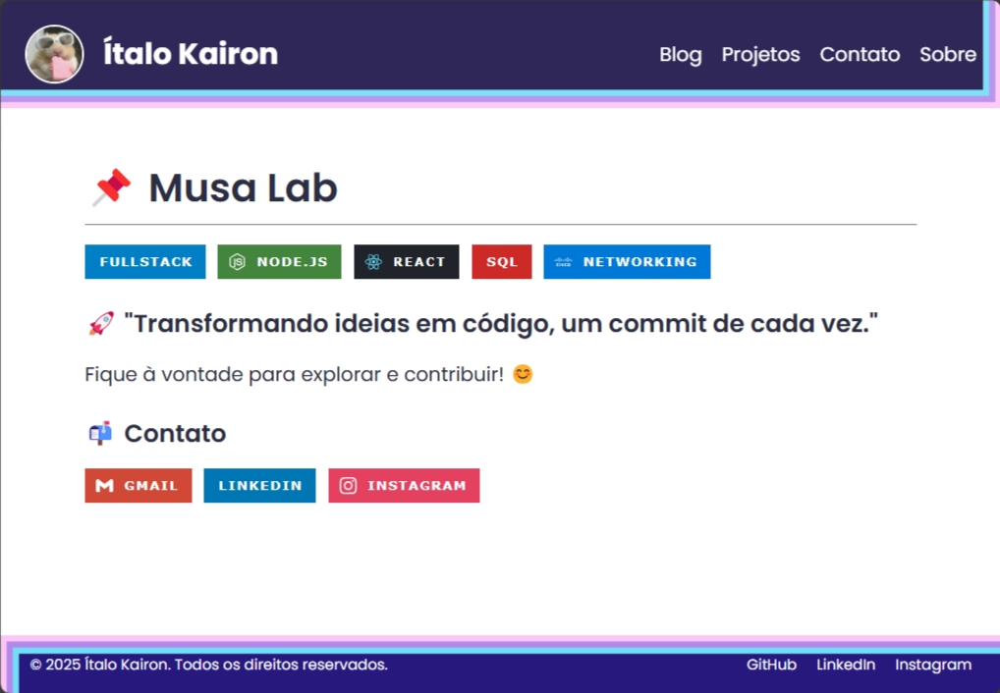

# italokairon.com

## Descrição

Sabe aqueles projetos que você sempre quer fazer, mas nunca tem tempo? Este é a junção de todos os meus. Alguns já estão implementados, outros ainda estarão, seja no backend ou no frontend. Além disso, outros projetos independentes também serão publicados aqui. A ideia principal é criar algo simples, aprimorá-lo e escalá-lo com o tempo. Para registrar esse processo, criei a seção de "posts", onde documentarei toda a evolução.

<!-- printscreenshot ./image.png -->

## Tecnologias

- **Node.js**: Ambiente de execução JavaScript.
- **Express**: Framework web minimalista para Node.js.
- **Docker**: Plataforma para desenvolvimento, envio e execução de aplicativos em contêineres.
- **Markdown**: Linguagem de marcação para documentação e criação dos posts.

## Contribuição

Se você tem sugestões ou melhorias, sinta-se à vontade para contribuir! Envie um pull request ou abra uma issue no repositório.

## Licença

Este projeto está sob a licença MIT.
